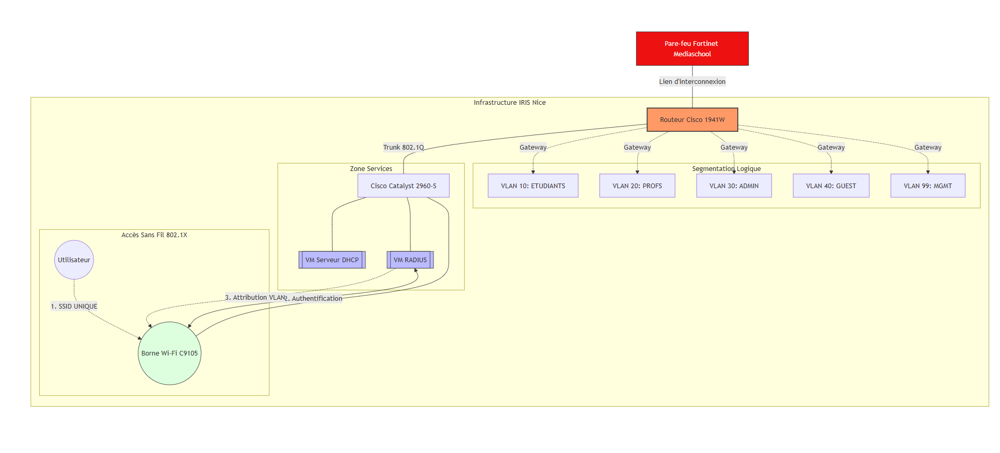

# L1 — Schéma d'Architecture des Services Open Source
**Projet :** RP-03 — Déploiement d'outils open source pour CFA IRIS Nice  
**Focus Principal :** GLPI (Helpdesk & Ticketing)  
**Services Secondaires :** Nextcloud, Outline, LGP (Monitoring), Traefik  
**Auteur :** Louka Lavenir  
**Date :** 20 mars 2026

---

## 1. Architecture Réseau Existante (RP-01)

L'infrastructure réseau de l'école IRIS Nice est déjà opérationnelle depuis le projet RP-01. Les services applicatifs déployés dans RP-03 s'appuient sur cette base.

### 1.1 Équipements réseau

| Équipement | Modèle | Rôle | Caractéristiques clés |
|:---|:---|:---|:---|
| **Switches** | Cisco Catalyst 2960-S | Commutation / segmentation VLAN | Layer 2 manageable, PoE+, support 802.1Q, port-security |
| **Points d'accès WiFi** | Cisco Catalyst C9105AXI-E | Accès sans fil sécurisé | WiFi 6 (802.11ax), PoE alimenté par le 2960-S, support WPA2/WPA3-Enterprise, 802.1X |
| **Routeurs** | Cisco CISCO1941W-E/K9 | Routage inter-VLAN / passerelle | Routeur ISR G2, modules intégrés, ACLs, NAT |

### 1.2 Schéma infrastructure réseau



**Légende :**
- **Internet** → Routeur Cisco 1941 (Gateway)
- **Switch Catalyst 2960-S** avec Spanning Tree Protocol (STP) pour prévention des boucles
- **VLAN 10** (Serveurs) : Virtualisation, RADIUS, DNS/DHCP, Services applicatifs (GLPI, Nextcloud, Wiki, Monitoring, Traefik)
- **VLAN 20** (Postes Étudiants) : Postes filaires salle TP
- **VLAN 30** (WiFi Étudiants) : Access Point C9105 WiFi 6
- **VLAN 99** (Administration) : Management switches/routeurs/AP

### 1.3 Plan de segmentation VLAN

| VLAN | ID | Réseau | Usage |
|:---|:---|:---|:---|
| **Serveurs** | 10 | 10.10.10.0/24 | Serveur de virtualisation, RADIUS, DNS/DHCP, **Services applicatifs (GLPI, Nextcloud, Wiki, Monitoring, Traefik)** |
| **Postes étudiants** | 20 | 10.10.20.0/24 | Postes filaires salle TP |
| **WiFi étudiants** | 30 | 10.10.30.0/24 | Accès WiFi via AP C9105 |
| **Administration** | 99 | 10.10.99.0/24 | Management switches/routeurs/AP |

**Point clé :** Tous les services applicatifs (GLPI, Nextcloud, Outline, Grafana, Traefik) sont hébergés sur le **VLAN 10 (Serveurs)**, isolés des postes utilisateurs.

---

## 2. Architecture Applicative (RP-03)

### 2.1 Vue d'ensemble

L'architecture applicative repose sur une **approche conteneurisée (Docker)** avec un **reverse proxy centralisé (Traefik)** qui expose tous les services en HTTPS sur le port 4433.

**Note importante :** Le déploiement est désormais actif en HTTPS (port 4433), avec redirection HTTP vers HTTPS.

**Service Principal :** GLPI (Helpdesk & Ticketing)  
**Services Secondaires :** Nextcloud, Outline, LGP (Monitoring), Traefik

**Authentification unifiée :** Tous les services s'authentifient via **LDAP** sur l'OpenLDAP existant (RP-02).

### 2.2 URLs d'accès (via Traefik)

| Service | URL | Authentification | Port interne |
|:---|:---|:---|:---|
| **GLPI (Helpdesk)** | https://glpi.iris.a3n.fr:4433 | LDAP | 80 |
| **Nextcloud (Cloud)** | https://cloud.iris.a3n.fr:4433 | LDAP | 80 |
| **Outline (Wiki)** | https://wiki.iris.a3n.fr:4433 | OIDC via bridge LDAP | 3000 |
| **Grafana (Monitoring)** | https://grafana.iris.a3n.fr:4433 | LDAP | 3000 |

**Note :** Outline ne supporte pas l'authentification LDAP nativement. Un bridge OIDC (Authelia ou Dex) est nécessaire pour connecter Outline à l'OpenLDAP, ou remplacer Outline par Dokuwiki/BookStack qui supportent LDAP nativement.

**Certificat HTTPS :** Auto-signé avec CN=*.iris.a3n.fr, distribué via GPO aux postes clients.

---

## 3. Flux Réseau et Ports

### 3.1 Flux utilisateur → Services

```
Utilisateur (VLAN 20/30)
        │
        │ HTTP (443)
        ▼
  Traefik (VLAN 10)
        │
        ├─→ GLPI:8080
        ├─→ Nextcloud:8080
        ├─→ Outline:8080
        └─→ Grafana:3000
```

### 3.2 Flux applicatifs → OpenLDAP

```
GLPI / Nextcloud / Outline / Grafana
        │
        │ LDAP Bind (389/636)
        ▼
  OpenLDAP (RP-02)
  - Authentification utilisateurs
  - Groupes (Admin, Enseignants, Étudiants)
```

### 3.3 Flux monitoring

```
Prometheus (VLAN 10)
        │
        ├─→ Exporters (CPU, RAM, Disk)
        ├─→ SNMP (Switches, Routeurs Cisco)
        └─→ Blackbox Exporter (tests HTTP/HTTP)
        
Loki (VLAN 10)
        │
        └─→ Promtail (collecte logs services)
        
Grafana (VLAN 10)
        │
        ├─→ Prometheus (métriques)
        └─→ Loki (logs)
```

### 3.4 Tableau récapitulatif des ports

| Service | Port Externe | Port Interne | Protocole | Accès |
|:---|:---|:---|:---|:---|
| Traefik Dashboard | 8080 | 8080 | HTTP | Admin uniquement (VLAN 99) |
| Traefik HTTP | 443 | 443 | HTTP | VLAN 20, 30 (utilisateurs) |
| GLPI | — | 8080 | HTTP | Via Traefik uniquement |
| Nextcloud | — | 8080 | HTTP | Via Traefik uniquement |
| Outline | — | 8080 | HTTP | Via Traefik uniquement |
| Grafana | — | 3000 | HTTP | Via Traefik uniquement |
| Prometheus | — | 9090 | HTTP | Interne uniquement |
| Loki | — | 3100 | HTTP | Interne uniquement |
| MariaDB | — | 3306 | TCP | Interne uniquement |
| OpenLDAP LDAP | 389/636 | 389/636 | LDAP/LDAPS | VLAN 10 → AD |

**Règle de sécurité :** Aucun service applicatif n'est directement accessible depuis les VLANs utilisateurs. **Tout passe par Traefik** (reverse proxy centralisé).

---

## 4. Intégration OpenLDAP (LDAP)

### 4.1 Configuration LDAP unifiée

Tous les services utilisent la même configuration LDAP pour se connecter à l'OpenLDAP (RP-02) :

**Paramètres LDAP :**
- **Serveur LDAP :** `ldap://openldap:389`
- **Base DN :** `dc=mediaschool,dc=local`
- **Bind DN :** `cn=admin,dc=mediaschool,dc=local`
- **Filtre utilisateurs :** `(objectClass=inetOrgPerson)`
- **Groupes AD utilisés :**
  - `CN=Admins,OU=Groups,dc=mediaschool,dc=local` → Administrateurs
  - `CN=Enseignants,OU=Groups,dc=mediaschool,dc=local` → Enseignants
  - `CN=Etudiants,OU=Groups,dc=mediaschool,dc=local` → Étudiants

### 4.2 Mapping groupes AD → Rôles applicatifs

| Service | Groupe AD | Rôle applicatif |
|:---|:---|:---|
| **GLPI** | Admins | Super-Admin |
| **GLPI** | Enseignants | Technicien |
| **GLPI** | Étudiants | Utilisateur |
| **Nextcloud** | Admins | Admin |
| **Nextcloud** | Enseignants | Utilisateur (quota élevé) |
| **Nextcloud** | Étudiants | Utilisateur (quota standard) |
| **Outline** | Admins | Admin |
| **Outline** | Enseignants | Éditeur |
| **Outline** | Étudiants | Lecteur |
| **Grafana** | Admins | Admin |
| **Grafana** | Enseignants | Éditeur |
| **Grafana** | Étudiants | Viewer |

**Avantage :** Un seul compte AD par utilisateur pour accéder à tous les services. Pas de gestion de comptes locaux multiples.

---

## 5. Déploiement Docker

### 5.1 Stack Docker Compose

Tous les services sont déployés via **Docker Compose** pour garantir :
- **Portabilité** (réplicable sur n'importe quel serveur Linux)
- **Isolation** (chaque service dans son conteneur)
- **Simplicité de maintenance** (un seul `docker compose up -d` pour tout démarrer)

**Structure des fichiers :**
```
/opt/iris-services/
├── docker-compose.yml          # Orchestration globale
├── traefik/
│   ├── traefik.yml             # Config Traefik
│   └── certs/                  # Certificats SSL
├── glpi/
│   └── config/                 # Config GLPI
├── nextcloud/
│   └── config/                 # Config Nextcloud
├── outline/
│   └── config/                 # Config Outline
├── monitoring/
│   ├── prometheus.yml
│   ├── loki-config.yml
│   └── grafana/
└── volumes/                    # Données persistantes
    ├── glpi-data/
    ├── nextcloud-data/
    ├── outline-data/
    ├── grafana-data/
    └── mariadb-data/
```

### 5.2 Volumes persistants

**Données critiques stockées dans des volumes Docker persistants :**
- `/opt/iris-services/volumes/glpi-data/` → Pièces jointes tickets, base de connaissances
- `/opt/iris-services/volumes/nextcloud-data/` → Fichiers utilisateurs
- `/opt/iris-services/volumes/outline-data/` → Pages wiki
- `/opt/iris-services/volumes/mariadb-data/` → Bases de données

**Sauvegarde :** Ces volumes sont sauvegardés quotidiennement (hors scope RP-03, mais recommandé).

---

## 6. Sécurité

### 6.1 Certificats HTTP

**Traefik génère et gère les certificats SSL :**
- **Type :** Certificat auto-signé wildcard `*.iris.a3n.fr`
- **Distribution :** Certificat CA distribué via GPO AD aux postes clients (RP-02)
- **Validité :** 1 an (renouvellement manuel)
- **Protocoles :** TLS 1.2 minimum, TLS 1.3 recommandé

**Configuration Traefik :**
```yaml
entryPoints:
  web:
    address: ":80"
    http:
      tls:
        options: default
        certResolver: selfSigned
```

### 6.2 Headers de sécurité HTTP

Traefik injecte automatiquement des headers de sécurité sur toutes les réponses :

```yaml
middlewares:
  security-headers:
    headers:
      sslRedirect: true
      forceSTSHeader: true
      stsSeconds: 31536000
      stsIncludeSubdomains: true
      contentTypeNosniff: true
      frameDeny: true
      browserXssFilter: true
      referrerPolicy: "same-origin"
```

**Effet :** Protection contre XSS, clickjacking, MIME sniffing, redirection HTTP forcée vers HTTP.

### 6.3 Restrictions réseau

**ACLs configurées sur le routeur Cisco 1941 :**
- VLAN 20/30 (utilisateurs) → accès HTTP (443) vers VLAN 10 autorisé
- VLAN 20/30 → accès direct aux services internes (8080, 3000, 9090) **bloqué**
- VLAN 99 (admin) → accès complet à tous les ports

**Règle firewall sur le serveur Linux (iptables) :**
```bash
# Autoriser HTTP depuis utilisateurs
iptables -A INPUT -p tcp --dport 80 -s 10.10.20.0/24 -j ACCEPT
iptables -A INPUT -p tcp --dport 80 -s 10.10.30.0/24 -j ACCEPT

# Bloquer accès direct aux services internes
iptables -A INPUT -p tcp --dport 8080 -s 10.10.20.0/24 -j DROP
iptables -A INPUT -p tcp --dport 8080 -s 10.10.30.0/24 -j DROP
iptables -A INPUT -p tcp --dport 3000 -s 10.10.20.0/24 -j DROP
iptables -A INPUT -p tcp --dport 3000 -s 10.10.30.0/24 -j DROP

# Admin VLAN → accès complet
iptables -A INPUT -s 10.10.99.0/24 -j ACCEPT
```

### 6.4 Authentification centralisée

**Tous les services utilisent LDAP (OpenLDAP) :**
- Pas de comptes locaux (sauf compte admin de secours)
- Mots de passe gérés centralement dans l'AD
- Groupes AD mappés sur les rôles applicatifs

**Avantage sécurité :**
- Désactivation d'un compte AD → accès révoqué sur tous les services
- Politique de mot de passe AD appliquée partout
- Logs d'authentification centralisés

---

## 7. Focus GLPI — Architecture Helpdesk

### 7.1 Workflow de ticketing

GLPI implémente un système de ticketing professionnel avec classification par **niveau d'intervention (N1/N2/N3)** :


**Niveaux d'intervention :**
- **N1** — Support de base (réinitialisation MDP, création compte, demande d'info)
- **N2** — Support technique (problème matériel, réseau, config système)
- **N3** — Expertise (bug critique, sécurité, développement, architecture)

### 7.2 Catégories de tickets GLPI

| Catégorie | Exemples | Niveau typique |
|:---|:---|:---|
| **Problème réseau** | Pas de connexion WiFi, IP incorrecte, VLAN bloqué | N2 |
| **Problème login** | Impossible de se connecter, MDP oublié | N1 |
| **Demande d'installation** | Installer un logiciel, créer un compte | N1 |
| **Problème matériel** | PC ne démarre pas, écran cassé | N2 |
| **Demande évolution** | Nouvelle fonctionnalité, modification config | N3 |
| **Sécurité** | Faille détectée, accès non autorisé | N3 |

### 7.3 Cycle de vie d'un ticket

**États GLPI :**
1. **Nouveau** — Ticket créé, en attente d'assignation
2. **Attribué** — Ticket assigné à un technicien
3. **En cours** — Intervention en cours
4. **En attente** — Bloqué (en attente utilisateur ou ressource externe)
5. **Résolu** — Solution appliquée, en attente validation utilisateur
6. **Clos** — Ticket validé et fermé définitivement

### 7.4 Notifications GLPI

**Emails automatiques envoyés lors de :**
- Création d'un ticket → utilisateur + techniciens N1
- Assignation à un technicien → technicien concerné
- Ajout d'un suivi → utilisateur + technicien assigné
- Résolution → utilisateur (demande validation)
- Clôture → utilisateur (confirmation finale)

**Configuration SMTP :** GLPI utilise un serveur SMTP interne ou externe pour l'envoi des notifications.

### 7.5 Interfaces GLPI

**Interface utilisateur (Self-Service) :**
- Créer un ticket
- Suivre ses tickets
- Ajouter des informations complémentaires
- Valider la résolution

**Interface technicien :**
- Vue globale des tickets (dashboard)
- Assignation / prise en charge
- Ajout de suivis techniques
- Résolution et clôture
- Statistiques (tickets par catégorie, temps de résolution moyen)

**Interface admin :**
- Configuration des catégories
- Gestion des profils utilisateurs
- Paramétrage LDAP
- Gestion des notifications
- Extraction de rapports

---

## 8. Services Secondaires

### 8.1 Nextcloud (Cloud interne)

**Rôle :** Stockage et collaboration de fichiers pour enseignants et étudiants.

**Fonctionnalités activées :**
- Stockage de fichiers avec quotas par groupe AD
- Calendrier partagé
- Contacts
- Édition collaborative (OnlyOffice ou Collabora)
- Partages par groupe AD (ex : espace SISR, espace SLAM)

**Authentification :** LDAP (groupes AD)  
**Quotas :**
- Étudiants : 5 Go
- Enseignants : 50 Go
- Admin : Illimité

### 8.2 Outline (Wiki interne)

**Rôle :** Documentation technique centralisée.

**Arborescence initiale :**
- Infrastructure (RP-01)
- OpenLDAP (RP-02)
- Services applicatifs (RP-03)
- Procédures
- Guides utilisateurs

**Authentification :** LDAP (groupes AD)  
**Droits :**
- Admin → Lecture/Écriture/Suppression
- Enseignants → Lecture/Écriture
- Étudiants → Lecture seule

### 8.3 LGP Stack (Monitoring)

**Rôle :** Supervision de l'infrastructure et des services.

**Composants :**
- **Prometheus** — Collecte des métriques (CPU, RAM, disque, réseau)
- **Loki** — Centralisation des logs
- **Grafana** — Visualisation (dashboards)
- **Exporters** — Node Exporter, Blackbox Exporter, SNMP Exporter

**Métriques surveillées :**
- CPU > 90% → Alerte
- Disque > 85% → Alerte
- Service down → Alerte critique
- SNMP (switches Cisco) → Bande passante, erreurs

**Dashboards Grafana :**
- Vue d'ensemble infrastructure
- État des services (GLPI, Nextcloud, Outline)
- Performances réseau (SNMP Cisco)
- Logs applicatifs (Loki)

### 8.4 Traefik (Reverse Proxy)

**Rôle :** Point d'entrée unique pour tous les services en HTTPS.

**Fonctionnalités :**
- Routage automatique par nom de domaine
- Génération certificats SSL
- Injection headers de sécurité
- Logs d'accès centralisés
- Dashboard d'administration

**Avantages vs Nginx :**
- Configuration automatique (détecte les conteneurs Docker)
- Let's Encrypt intégré (ACME)
- Support TCP/UDP natif
- Dashboard intégré
- Moins d'erreurs humaines (pas de config manuelle par service)

---

## 9. Plan de Tests

### 9.1 Tests accès HTTPS

- [ ] Accès https://glpi.iris.a3n.fr:4433 depuis VLAN 20
- [ ] Accès https://cloud.iris.a3n.fr:4433 depuis VLAN 30
- [ ] Accès https://wiki.iris.a3n.fr:4433 depuis VLAN 20
- [ ] Accès https://grafana.iris.a3n.fr:4433 depuis VLAN 99
- [ ] Vérification certificat SSL accepté par les postes (GPO AD)
- [ ] Redirection HTTP → HTTPS automatique

### 9.2 Tests authentification LDAP

- [ ] Login GLPI avec compte LDAP (groupe Étudiants) → rôle Utilisateur
- [ ] Login GLPI avec compte LDAP (groupe Enseignants) → rôle Technicien
- [ ] Login GLPI avec compte LDAP (groupe Admins) → rôle Super-Admin
- [ ] Login Nextcloud avec compte LDAP → quota correct selon groupe
- [ ] Login Outline avec compte LDAP → droits lecture/écriture selon groupe
- [ ] Login Grafana avec compte LDAP → rôle Viewer/Éditeur/Admin selon groupe

### 9.3 Tests restrictions réseau

- [ ] Accès direct au port interne GLPI depuis VLAN 20 → **bloqué**
- [ ] Accès direct au port interne Grafana depuis VLAN 30 → **bloqué**
- [ ] Accès HTTPS (4433) depuis VLAN 20/30 → **autorisé**
- [ ] Accès complet depuis VLAN 99 (admin) → **autorisé**

### 9.4 Tests workflow GLPI

- [ ] Création ticket par utilisateur (interface self-service)
- [ ] Notification email reçue (utilisateur + techniciens)
- [ ] Assignation ticket à un technicien N1/N2/N3
- [ ] Ajout suivi technique
- [ ] Résolution ticket
- [ ] Validation utilisateur
- [ ] Clôture ticket
- [ ] Statistiques visibles dans dashboard admin

### 9.5 Tests services secondaires

- [ ] Upload fichier dans Nextcloud → téléchargement OK
- [ ] Création page wiki dans Outline → édition collaborative
- [ ] Consultation dashboard Grafana → métriques en temps réel
- [ ] Alerte Prometheus → notification si service down

---

## 10. Conclusion

Cette architecture répond aux exigences de l'appel d'offre RP-03 en plaçant **GLPI (helpdesk)** au centre du dispositif, complété par une suite de services collaboratifs (Nextcloud, Outline, Monitoring).

**Points clés de l'architecture :**
1. **Infrastructure réseau sécurisée** (RP-01) avec segmentation VLAN
2. **Authentification centralisée** via OpenLDAP (RP-02)
3. **Point d'entrée unique** (Traefik) pour tous les services en HTTPS (port 4433)
4. **Isolation des services** (conteneurs Docker sur VLAN Serveurs)
5. **Workflow professionnel de ticketing** aligné ITIL (GLPI N1/N2/N3)
6. **Monitoring complet** (LGP Stack)

**Prochaines étapes :** Documentation détaillée de chaque service (L2 à L8).

---

**Auteur :** Louka Lavenir  
**Date :** 20 mars 2026  
**Version :** 1.0


