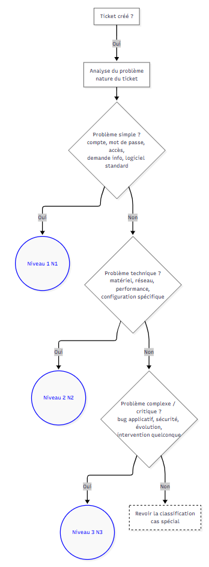

<<<<<<< HEAD
# Conception, sécurisation et mise en place d'outils open source
**Projet :** Conception, sécurisation et mise en place d'outils open source  
**Type :** Réalisation professionnelle  
=======
# Dossier de Réalisation Professionnelle GLPI (Version structurée)
**Projet :** Déploiement d'outils open source pour CFA IRIS Nice  
**Réalisation n° :** 3  
>>>>>>> 90e857c675e65b8f06c4122978ab07a8511f4abb
**Auteur :** Louka Lavenir  
**Période de réalisation :** 24/11/2025 au 28/11/2025  
**Lieu :** Mediaschool — IRIS Nice  
---

## INTRODUCTION

L’objectif est de concevoir et déployer une plateforme de services open source orientée exploitation réelle, avec **GLPI** comme service desk principal.

La solution est intégrée à une infrastructure Linux conteneurisée, avec publication centralisée via Traefik, authentification annuaire Active Directory et supervision technique continue.

Ce document présente l’approche d’architecture, la mise en œuvre, la sécurisation, la validation fonctionnelle et un référentiel complet de benchmarks, en particulier pour GLPI.

---

## SOMMAIRE

1. Contexte et enjeux  
2. Objectifs, périmètre et compétences mobilisées  
3. Architecture de la solution  
4. Mise en œuvre technique  
5. Paramétrage helpdesk et intégration annuaire  
6. Sécurisation, exploitation et maintenance  
7. Recette fonctionnelle et validation  
8. Benchmarks de performance et d’exploitation  
9. Bilan professionnel et perspectives  
10. Sources techniques  
11. Annexes

---

## 1. Contexte et enjeux

Avant la mise en place de la solution, les demandes d’assistance étaient majoritairement traitées de manière informelle (oral, messages), ce qui entraînait :

- perte de demandes ;
- absence de traçabilité ;
- faible visibilité sur la charge de support ;
- absence de priorisation et d’historique exploitable.

La démarche adoptée industrialise le support avec un cycle de ticket standard :

1. Déclaration de l’incident par l’utilisateur  
2. Qualification (catégorie, urgence, priorité)  
3. Affectation à un technicien  
4. Traitement avec suivi  
5. Résolution puis clôture

---

## 2. Objectifs, périmètre et compétences mobilisées

### 2.1 Objectifs opérationnels

- Déployer une plateforme GLPI fonctionnelle sur serveur Linux.
- Assurer une persistance robuste des données (tickets, utilisateurs, configuration).
- Structurer les rôles et le workflow de traitement des tickets.
- Intégrer l’authentification à l’annuaire Active Directory.
- Produire une documentation technique et utilisateur exploitable.

### 2.2 Périmètre technique

- **Service principal :** GLPI (ticketing / helpdesk)  
- **Services d’écosystème :** reverse proxy Traefik, base MariaDB, annuaire AD, supervision (Grafana/Loki/Prometheus), documentation Wiki.

### 2.3 Compétences BTS SISR mobilisées

- Concevoir une solution d’infrastructure réseau  
- Installer, tester et déployer une solution  
- Exploiter, dépanner et superviser la solution

### 2.4 Ressources mobilisées

- **Matériel :** serveur Dell PowerEdge, équipements Cisco (routeur/switch/AP)  
- **Logiciels :** Docker, Docker Compose, GLPI, MariaDB, Traefik  
- **Ressources documentaires :** documentation officielle GLPI et documentation interne de l’architecture.

---

## 3. Architecture de la solution

### 3.1 Positionnement global

GLPI est hébergé dans le VLAN serveurs et exposé via Traefik.  
L’authentification des utilisateurs est déléguée à l’Active Directory pour éviter la gestion de comptes locaux multiples.

### 3.2 Composants techniques

| Composant | Rôle |
|:---|:---|
| GLPI (conteneur applicatif) | Interface helpdesk, gestion tickets et profils |
| MariaDB (conteneur base) | Stockage des tickets, entités, profils, historiques |
| Traefik | Publication centralisée et routage des services |
| Active Directory (LDAP) | Authentification et mapping des rôles |

### 3.3 Principes d’architecture retenus

- conteneurisation pour portabilité et maintenance ;
- isolation des services et séparation des responsabilités ;
- persistance via volumes Docker ;
- centralisation des accès via reverse proxy ;
- alignement des droits applicatifs sur les groupes annuaire.

---

## 4. Mise en œuvre technique

### 4.1 Déploiement de la stack

Le déploiement est réalisé via Docker Compose, avec un service GLPI et un service MariaDB, puis raccordement au réseau partagé de publication.

Principe de démarrage :

1. Préparer les dossiers de volumes persistants  
2. Définir les variables sensibles dans un fichier d’environnement  
3. Démarrer la stack en mode détaché  
4. Vérifier la disponibilité applicative et la connectivité base

### 4.2 Initialisation GLPI

Après démarrage :

- initialisation via assistant d’installation ;
- configuration de la connexion base de données ;
- création de l’instance ;
- sécurisation immédiate des comptes par défaut.

### 4.3 Paramètres système importants

- fuseau horaire et paramètres régionaux ;
- configuration des notifications ;
- définition des entités/profils ;
- suppression des artefacts d’installation.

---

## 5. Paramétrage helpdesk et intégration annuaire

### 5.1 Modèle de rôles

Trois profils fonctionnels sont mis en place :

- **Utilisateur final** : création/suivi des tickets ;  
- **Technicien** : traitement, suivi, résolution ;  
- **Administrateur** : gouvernance de l’outil (règles, profils, paramètres).

### 5.2 Catégorisation et priorisation

Le catalogue de tickets est organisé pour faciliter le tri et l’assignation :

- incidents réseau ;  
- incidents d’authentification ;  
- demandes d’installation ;  
- autres demandes.

La priorité repose sur l’impact et l’urgence, permettant d’ordonner les interventions.

### 5.3 Workflow de cycle de vie

Cycle appliqué dans GLPI :

**Nouveau → Attribué / En cours → En attente → Résolu → Clos**

Ce workflow garantit la traçabilité complète et la qualité de suivi.

### 5.4 Logigramme de qualification et d’escalade

### 5.5 Intégration LDAP / Active Directory

L’annuaire est configuré pour :

- authentifier les utilisateurs sur compte institutionnel ;
- récupérer les attributs d’identité utiles ;
- appliquer un mapping groupes annuaire → rôles GLPI.

Bénéfices :

- réduction du risque lié aux comptes locaux ;
- cohérence des droits ;
- administration simplifiée.

---

## 6. Sécurisation, exploitation et maintenance

### 6.1 Mesures de sécurisation appliquées

- gestion des secrets hors code ;
- durcissement des comptes applicatifs ;
- segmentation réseau et exposition maîtrisée ;
- principe de moindre privilège sur les rôles.

### 6.2 Exploitation quotidienne

- supervision de disponibilité du service ;
- suivi de charge et des tickets récurrents ;
- contrôle des files d’attente et des délais de traitement ;
- revue des incidents pour amélioration continue.

### 6.3 Sauvegarde et continuité

Stratégie recommandée :

- sauvegardes régulières base + volumes ;
- tests de restauration ;
- procédure de reprise documentée.

---

## 7. Recette fonctionnelle et validation

La recette couvre :

1. Accessibilité du service selon les segments réseau autorisés  
2. Authentification annuaire selon profils (étudiant, enseignant, administrateur)  
3. Fonctionnement du workflow ticketing  
4. Notifications et suivi des changements d’état  
5. Conformité des droits par rôle

**Résultat global :** service opérationnel, parcours de ticket complet validé, documentation technique et utilisateur disponible.

---

## 8. Benchmarks de performance et d’exploitation

### 8.1 Benchmarks prioritaires GLPI (applicatif)

| Indicateur GLPI | Cible recommandée | Mesure |
|:---|:---|:---|
| Disponibilité mensuelle GLPI | >= 99,5 % | Uptime monitor |
| Temps d’ouverture page login (p95) | <= 1,2 s | Navigateur + APM |
| Authentification LDAP (p95) | <= 2,0 s | Logs applicatifs |
| Création de ticket (p95) | <= 1,8 s | Test utilisateur instrumenté |
| Affectation d’un ticket (p95) | <= 1,2 s | Mesure UI |
| Changement d’état ticket (p95) | <= 1,0 s | Mesure UI |
| Ajout de suivi/commentaire (p95) | <= 1,0 s | Mesure UI |
| Recherche ticket (10k entrées, p95) | <= 2,5 s | Requête applicative |
| Chargement tableau technicien (p95) | <= 2,0 s | APM |
| Export CSV (1000 tickets) | <= 10 s | Test fonctionnel |
| Upload pièce jointe 10 Mo | <= 4 s | Test applicatif |
| Latence notifications e-mail | <= 30 s | Trace SMTP |
| Taux d’erreurs HTTP 5xx | <= 0,5 % | Reverse proxy logs |
| Temps de réponse API REST (p95) | <= 400 ms | Tests API |
| Sessions simultanées stables | >= 100 | Test de charge |

### 8.2 Benchmarks base de données et infrastructure

| Indicateur infra | Cible recommandée | Mesure |
|:---|:---|:---|
| Latence requêtes SQL critiques (p95) | <= 50 ms | Slow query log |
| CPU GLPI (moyenne) | <= 65 % | Prometheus |
| CPU GLPI (pic) | <= 85 % | Prometheus |
| RAM GLPI | <= 2,5 Go | cAdvisor |
| RAM MariaDB | <= 3,0 Go | cAdvisor |
| Temps de démarrage stack complète | <= 120 s | Docker events |
| Occupation disque volumes applicatifs | <= 80 % | Node exporter |
| I/O disque en charge | stable sans saturation | iostat / exporter |
| Sauvegarde base complète | <= 15 min | Job backup |
| Restauration base complète | <= 20 min | Test PRA |
| RPO (perte max de données) | <= 24 h | Politique backup |
| RTO (remise en service) | <= 60 min | Exercice PRA |

### 8.3 Benchmarks de support et qualité de service

| Indicateur support | Cible recommandée | Mesure |
|:---|:---|:---|
| MTTA (prise en charge) | <= 15 min | Stats GLPI |
| MTTR incidents critiques | <= 4 h | Stats GLPI |
| Respect SLA global | >= 95 % | Rapports GLPI |
| Taux résolution au premier contact | >= 70 % | Rapports GLPI |
| Taux de réouverture de tickets | <= 8 % | Rapports GLPI |
| Tickets en backlog > 7 jours | <= 10 % | Rapports GLPI |
| Satisfaction utilisateur | >= 4/5 | Enquêtes post-clôture |

### 8.4 Benchmarks sécurité et conformité

| Indicateur sécurité | Cible recommandée | Mesure |
|:---|:---|:---|
| Correction vulnérabilités critiques | <= 72 h | Suivi patching |
| Couverture mises à jour mensuelles | 100 % | Journal de maintenance |
| Détection tentatives de connexion anormales | <= 1 min | Alerting SIEM/logs |
| Comptes administrateurs durcis | 100 % | Revue de configuration |
| Secrets hors dépôt de code | 100 % | Audit de configuration |
| Certificats TLS valides | 100 % | Monitoring certifs |

---

## 9. Bilan professionnel et perspectives

### 9.1 Acquis techniques

- déploiement d’un service métier en environnement conteneurisé ;
- structuration d’un processus de support réaliste ;
- intégration annuaire pour authentification centralisée ;
- formalisation d’une documentation exploitable en contexte réel.

### 9.2 Valeur ajoutée pour l’établissement

- support centralisé et traçable ;
- meilleure communication utilisateurs/techniciens ;
- historique exploitable pour piloter l’amélioration continue ;
- base solide pour les futurs projets d’infrastructure.

### 9.3 Pistes d’évolution

- enrichissement du portail utilisateur ;
- tableaux de bord avancés de pilotage ;
- automatisation renforcée des règles d’assignation ;
- extension des scénarios de supervision et d’alerting.

---

## 10. Sources techniques

- Documentation GLPI Serveur  
- Documentation officielle GLPI  
- Documentation Docker et Docker Compose  
- Documentation Traefik et bonnes pratiques TLS  
- Documentation LDAP / Active Directory

---

## 11. Annexes

| Référence | Titre |
|:---|:---|
| L1 | Schéma d’architecture |
| L2 | Documentation GLPI + LDAP |
| L3 | Documentation Nextcloud + LDAP |
| L4 | Documentation Wiki Outline + LDAP |
| L5 | Documentation Stack LGP Monitoring |
| L6 | Documentation Traefik |
| L7 | Guide utilisateur GLPI |
| L8 | Procédure d’intégration de service dans Traefik |
| L9 | Procès-verbal de recette |

